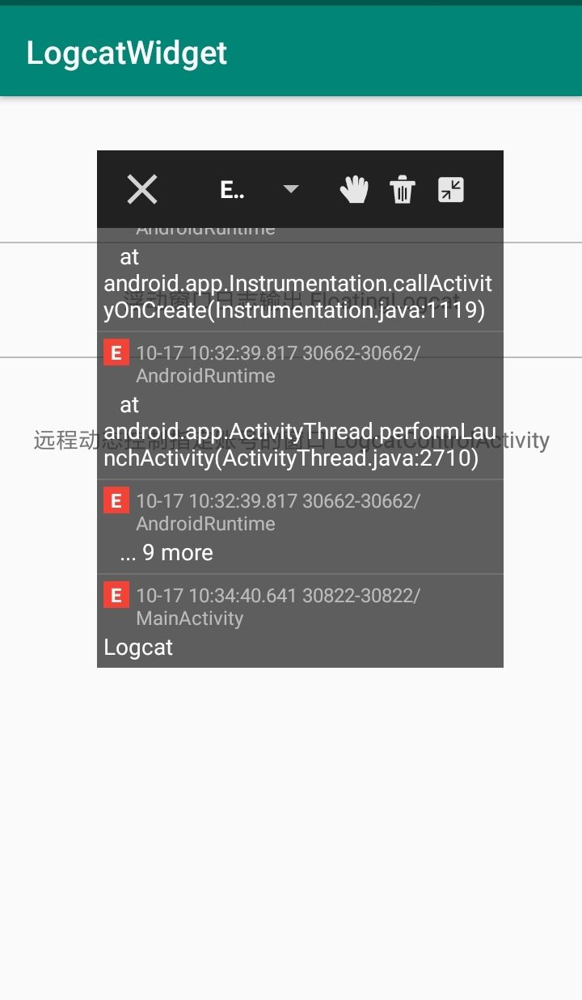

# LogcatWidget

Log日誌插件
[](https://jitpack.io/#justinelock/LogcatWidget)  

LogcatWidget 是一个Android浮动窗口日志输出库！获取应用程序的logcat输出日志并以窗口的形式悬浮在应用上层，支持悬浮窗口缩放，拖动，支持日志文件过滤，清除，保存分享。可以自定义接口远程动态控制 LogcatWidget 浮动日志窗口显示与关闭，测试阶段（方便测试人员和开发者定位异常），发布线上阶段(动态控制指定账号用户LogcatWidget浮动日志窗口显示与关闭，方便异常机型的用户反馈问题，开发人员针对指定机型进行适配)。
说明：动态控制指定账号用户LogcatWidget浮动日志窗口显示与关闭。

### LogcatWidget 功能介绍

 * 日志输出过滤
 * 悬浮窗口拖动
 * 日志输出清除
 * 分享保存log日志文本
 * log日志页面放大缩小


### Usage
##### Step 1. Add a JitPack repertory
```
allprojects {
    repositories {
        ...
        maven { url "https://jitpack.io" }
    }
}
```

##### Step 2. Add a gradle dependency
```
dependencies {
	implementation 'com.github.justinelock:LogcatWidget:1.0.1'
}
```

##### Step 3. Add following provider code to your AndroidManifest.xml
```
<provider
    android:name="com.widget.logviewer.LogcatFileProvider"
    android:authorities="${applicationId}.logcat_fileprovider"
    android:grantUriPermissions="true"
    android:exported="false">
    <meta-data
        android:name="android.support.FILE_PROVIDER_PATHS"
        android:resource="@xml/logcat_filepaths" />
</provider>
```

##### Step 4. Use the class in the need to print the log
```
public class MainActivity extends AppCompatActivity {

    @Override
    protected void onCreate(Bundle savedInstanceState) {
        super.onCreate(savedInstanceState);
        setContentView(R.layout.activity_main);

        //Use this method
        LogcatActivity.launch(MainActivity.this);
    }
}
```


## Screenshots

### 样例示例应用

   


